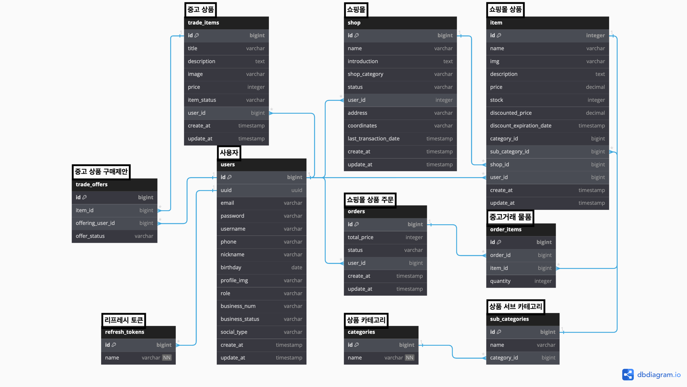

## 중고거래가 가능한 쇼핑몰 REST API
- 기존에 만들었던 쇼핑몰 애플리케이션을 수정하고 발전시킨 리팩토링 프로젝트 입니다. 
- 개발 기간 : 24.07.19 ~
- 참여 인원 : 1명

## 💻 기술 스택
- Language : `Java 17`
- Framework : 
  - `Spring Boot 3.3.1`, 
    - `Spring Security`
    - `querydsl 5.1.0`
    - `jjwt 0.12.3`
    - `OAuth2`
  - `React`
- Build : `gradle`
- DB : `PostgreSQL`, `Redis`
- ORM : `Spring Data JPA`
- Test/Documentation
  - `Postman`
  - `Swagger`

## 아키텍처


## 패키지 구조

<details>
<summary>패키지 구조</summary>
<div markdown="1">

```bash
    ├── front
    ├── main
    │   ├── java
    │   │   └── com
    │   │       └── example
    │   │           └── market
    │   │               ├── MarketApplication.java
    │   │               ├── domain
    │   │               │   ├── auth
    │   │               │   │   ├── constant
    │   │               │   │   │   ├── BusinessStatus.java
    │   │               │   │   │   ├── Role.java
    │   │               │   │   │   └── SocialType.java
    │   │               │   │   ├── controller
    │   │               │   │   │   └── UserController.java
    │   │               │   │   ├── dto
    │   │               │   │   │   ├── AccessTokenDto.java
    │   │               │   │   │   ├── BusinessDto.java
    │   │               │   │   │   ├── CreateUserDto.java
    │   │               │   │   │   ├── LoginDto.java
    │   │               │   │   │   ├── PrincipalDetails.java
    │   │               │   │   │   ├── ReissuanceDto.java
    │   │               │   │   │   ├── UpdateUserDto.java
    │   │               │   │   │   ├── UserDto.java
    │   │               │   │   │   └── oauth2
    │   │               │   │   │       ├── GoogleResponse.java
    │   │               │   │   │       ├── NaverResponse.java
    │   │               │   │   │       └── OAuth2Response.java
    │   │               │   │   ├── entity
    │   │               │   │   │   ├── RefreshToken.java
    │   │               │   │   │   └── User.java
    │   │               │   │   ├── handler
    │   │               │   │   │   └── OAuth2LoginSuccessHandler.java
    │   │               │   │   ├── jwt
    │   │               │   │   │   ├── JwtTokenDto.java
    │   │               │   │   │   ├── JwtTokenFilter.java
    │   │               │   │   │   ├── JwtTokenUtils.java
    │   │               │   │   │   └── TokenType.java
    │   │               │   │   ├── repository
    │   │               │   │   │   ├── RefreshTokenRepository.java
    │   │               │   │   │   └── UserRepository.java
    │   │               │   │   └── service
    │   │               │   │       ├── PrincipalDetailsService.java
    │   │               │   │       └── PrincipalOAuth2UserService.java
    │   │               │   ├── shop
    │   │               │   │   ├── constant
    │   │               │   │   │   ├── DiscountRate.java
    │   │               │   │   │   ├── OrderStatus.java
    │   │               │   │   │   ├── ShopCategory.java
    │   │               │   │   │   └── ShopStatus.java
    │   │               │   │   ├── controller
    │   │               │   │   │   ├── ItemController.java
    │   │               │   │   │   ├── OrderController.java
    │   │               │   │   │   └── ShopController.java
    │   │               │   │   ├── dto
    │   │               │   │   │   ├── CategoryDto.java
    │   │               │   │   │   ├── CreateItemDto.java
    │   │               │   │   │   ├── DiscountDto.java
    │   │               │   │   │   ├── ItemDto.java
    │   │               │   │   │   ├── OrderDto.java
    │   │               │   │   │   ├── OrderItemDto.java
    │   │               │   │   │   ├── PurchaseRequestDto.java
    │   │               │   │   │   ├── SearchItemDto.java
    │   │               │   │   │   ├── SearchShopDto.java
    │   │               │   │   │   ├── ShopDto.java
    │   │               │   │   │   ├── SubCategoryDto.java
    │   │               │   │   │   └── UpdateShopDto.java
    │   │               │   │   ├── entity
    │   │               │   │   │   ├── Category.java
    │   │               │   │   │   ├── Item.java
    │   │               │   │   │   ├── Order.java
    │   │               │   │   │   ├── OrderItem.java
    │   │               │   │   │   ├── Shop.java
    │   │               │   │   │   └── SubCategory.java
    │   │               │   │   ├── repository
    │   │               │   │   │   ├── CategoryRepository.java
    │   │               │   │   │   ├── ItemRepository.java
    │   │               │   │   │   ├── ItemRepositoryCustom.java
    │   │               │   │   │   ├── ItemRepositoryImpl.java
    │   │               │   │   │   ├── OrderItemRepository.java
    │   │               │   │   │   ├── OrderRepository.java
    │   │               │   │   │   ├── ShopRepository.java
    │   │               │   │   │   ├── ShopRepositoryCustom.java
    │   │               │   │   │   ├── ShopRepositoryImpl.java
    │   │               │   │   │   └── SubCategoryRepository.java
    │   │               │   │   └── service
    │   │               │   │       ├── ItemService.java
    │   │               │   │       ├── OrderService.java
    │   │               │   │       └── ShopService.java
    │   │               │   └── used_trade
    │   │               │       ├── controller
    │   │               │       │   ├── TradeItemController.java
    │   │               │       │   └── TradeOfferController.java
    │   │               │       ├── dto
    │   │               │       │   ├── TradeItemDto.java
    │   │               │       │   └── TradeOfferDto.java
    │   │               │       ├── entity
    │   │               │       │   ├── TradeItem.java
    │   │               │       │   └── TradeOffer.java
    │   │               │       ├── repository
    │   │               │       │   ├── TradeItemRepository.java
    │   │               │       │   ├── TradeOfferRepository.java
    │   │               │       │   ├── TradeOfferRepositoryCustom.java
    │   │               │       │   └── TradeOfferRepositoryImpl.java
    │   │               │       └── service
    │   │               │           ├── TradeItemService.java
    │   │               │           └── TradeOfferService.java
    │   │               └── global
    │   │                   ├── common
    │   │                   │   ├── AuthenticationFacade.java
    │   │                   │   └── BaseEntity.java
    │   │                   ├── config
    │   │                   │   ├── CorsMvcConfig.java
    │   │                   │   ├── JpaConfig.java
    │   │                   │   ├── PasswordEncoderConfig.java
    │   │                   │   ├── RedisConfig.java
    │   │                   │   ├── SwaggerConfig.java
    │   │                   │   └── WebSecurityConfig.java
    │   │                   ├── error
    │   │                   │   └── exception
    │   │                   │       ├── ErrorCode.java
    │   │                   │       ├── ErrorResponse.java
    │   │                   │       ├── GlobalCustomException.java
    │   │                   │       └── GlobalExceptionHandler.java
    │   │                   ├── infra
    │   │                   │   └── DataInitializer.java
    │   │                   └── util
    │   │                       ├── CookieUtil.java
    │   │                       ├── FileHandlerUtils.java
    │   │                       └── MultipartJackson2HttpMessageConverter.java
    │   └── resources
    │       ├── application-dev.yaml
    │       ├── application-prod.yaml
    │       ├── application-test.yaml
    │       ├── static
    │       └── templates
    │           ├── home.html
    │           ├── my-page.html
    │           ├── sign-in.html
    │           └── sign-up.html
```

</div>
</details>

## ERD



## 기능

<details>
<summary>회원 인증 및 권한 처리</summary>
<div markdown="1">

</div>
</details>

<details>
<summary>중고거래 중개</summary>
<div markdown="1">

</div>
</details>

<details>
<summary>쇼핑몰 운영</summary>
<div markdown="1">

</div>
</details>


## 기존 프로젝트를 발전시킨 부분

## 트러블 슈팅

## 학습 내용 정리

## 느낀점
